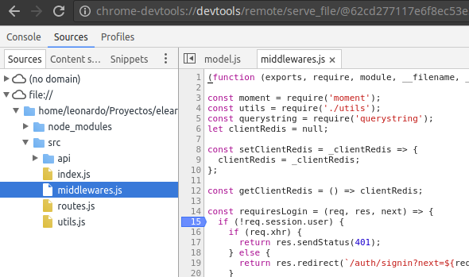
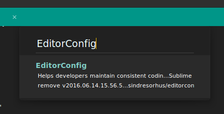
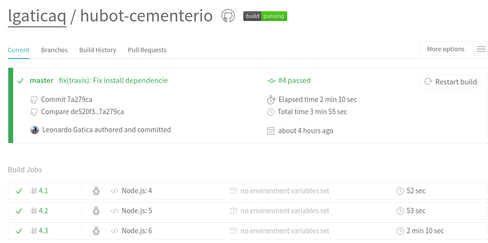
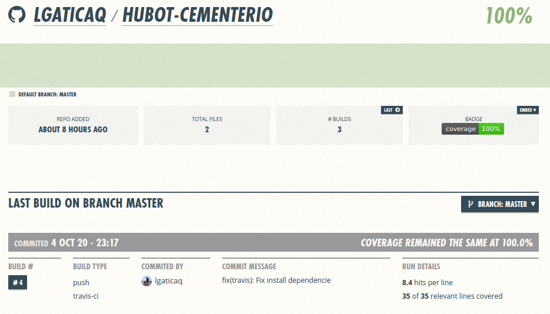
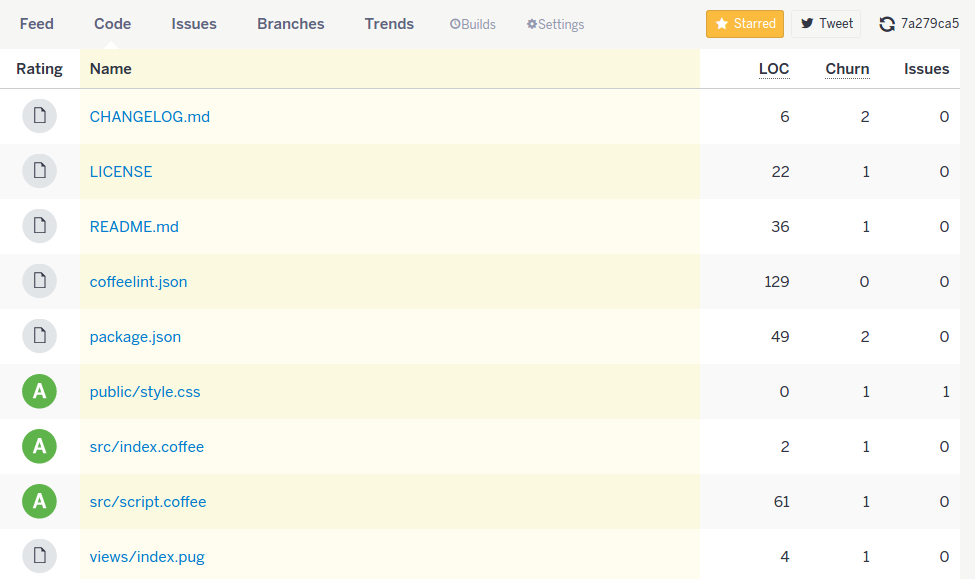
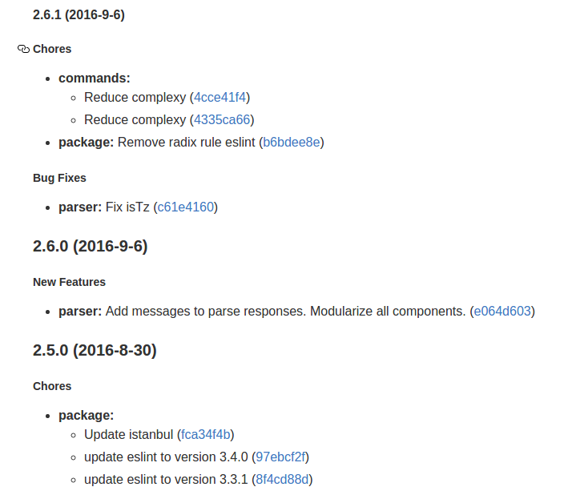

title: Beerjs #17
author:
  name: Leonardo Gatica
  twitter: lgaticaq
  url: https://about.me/lgatica
  email: lgatica@protonmail.com
output: index.html
theme: juanbrujo/cleaver-beerjs
style: style.css
controls: false

--

# Buenas practicas en el desarrollo con node

--

## node --inspector (node >=6.3)

```bash
node --inspector src
Debugger listening on port 9229.
Warning: This is an experimental feature and could change at any time.
To start debugging, open the following URL in Chrome:
    chrome-devtools://devtools/remote/serve_file/
    @521e5b7e2b7cc66b4006a8a54cb9c4e57494a5ef/
    inspector.html?experiments=true&v8only=true&ws=localhost:9229/node
info: Express app started on port 3000
```

--

## npm script

```bash
npm i -D nodemon
```

```json
"scripts": {
  "start": "node src",
  "start:dev": "nodemon -- --inspect src"
}
```

--



--

## editorconfig

```ini
root = true

[*]
indent_style = space
indent_size = 2
end_of_line = lf
charset = utf-8
trim_trailing_whitespace = true
insert_final_newline = true

[*.md]
trim_trailing_whitespace = false
```

--



--

## eslint

```bash
npm i -D eslint
./node_modules/.bin/eslint --init
./node_modules/.bin/eslint --fix
```

## .eslintignore

```
coverage
example.js
```

--

## package.json

```json
"eslintConfig": {
  "env": {
    "es6": true,
    "node": true,
    "mocha": true
  },
  "extends": "eslint:recommended",
  "rules": {
    "indent": [2, 2],
    "linebreak-style": [2, "unix"],
    "quotes": [2, "single"],
    "semi": [2, "always"]
  }
}
```

--

## travis (CI)

```yml
language: node_js
node_js:
  - "4"
  - "5"
  - "6"
notifications:
  email: false
after_success:
  - npm run coveralls
  - npm run codeclimate
```
--



--

## coveralls y codeclimate (coverage)

```json
"scripts": {
  "lint": "eslint .",
  "pretest": "npm run lint -s",
  "test": "istanbul cover _mocha",
  "coveralls": "coveralls < coverage/lcov.info",
  "codeclimate": "codeclimate-test-reporter < coverage/lcov.info"
},
```

--



--



--

## Semantic Commit

```bash
commit -m "chore(package): Actualizado moment"
commit -m "feat(models): Se agrego metodo para filtrar por empresa"
commit -m "fix(login): Se corrigio asignacion de permisos"
commit -m "docs(api): Se documento recurso de usuarios"
commit -m "refactor: share logic between 4d3d3d3 and flarhgunnstow"
commit -m "style: convert tabs to spaces"
commit -m "test: ensure Tayne retains clothing"
```

--

## generate-changelog

```json
"scripts": {
  "release:major": "changelog -M && git add CHANGELOG.md
    && git commit -m 'updated CHANGELOG.md' && npm version major
    && git push origin && git push origin --tags && npm publish"
  ,
  "release:minor": "changelog -m && git add CHANGELOG.md
    && git commit -m 'updated CHANGELOG.md' && npm version minor
    && git push origin && git push origin --tags && npm publish"
  ,
  "release:patch": "changelog -p && git add CHANGELOG.md
    && git commit -m 'updated CHANGELOG.md' && npm version patch
    && git push origin && git push origin --tags && npm publish"
}
```

--

## CHANGELOG.md



--

## docker-compose.yml

```yml
version: '2'
services:
  app:
    build: .
    ports:
      - "3000:80"
      - "9229:9229"
    environment:
      MONGODB_URI: mongodb://mongo/myapp
    volumes:
     - .:/opt/app
     - node_modules:/opt/app/node_modules
    depends_on:
      - mongo
    networks:
      - app
  mongo:
    image: mvertes/alpine-mongo
    volumes:
      - mongo:/data/db
    networks:
      - app
volumes:
  mongo:
  node_modules:
networks:
  app:
```

--

## docker-compose

```bash
docker-compose exec mongo sh
apk add --no-cache mongodb-tools
mongodump -u user -p pass -h host:port -d dbname -o /tmp/
mongorestore -d visto-bueno /tmp/dbname
apk del mongodb-tools
rm -rf /tmp/dbname
exit
```

```bash
docker-compose exec app npm t
```
